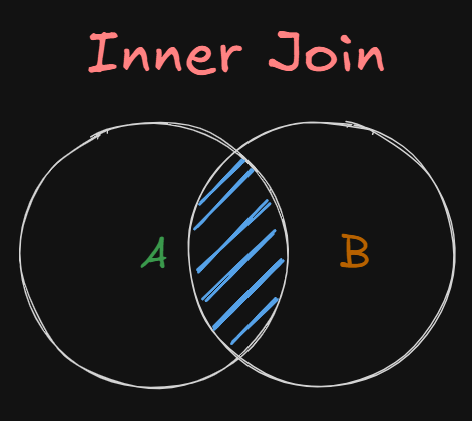

# SQL Table Joins Notes

- Short guide for SQL Joins
---

## What is SQL Join ?
Query and access data from multiple tables by establishing logical relationships between them.

It can access data from multiple tables simultaneously using common key values shared across different tables.

---
## Types of Joins

### 1. Inner Join:

